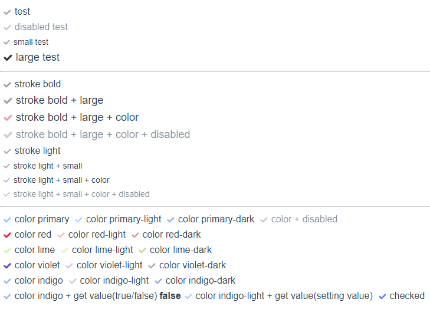
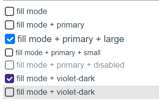

# edge-checkbox

```
Hi? my name is zero86.
I'm a developer making money with vue. 
Deploy the checkbox component. 
I hope others will save you time and if you have a problem please track the GitHub issue! 
Thank you.

2019.11.18
fill feature add
```

https://www.npmjs.com/package/@zero86/vue-edge-checkbox


### props list
```
props: {
    id: { type: String, default: '' },
    name: { type: String, default: '' },
    value: { type: [String, Number], default: '' },
    checked: { type: Boolean, default: false },
    disabled: { type: Boolean, default: false },
    strokeLight: { type: Boolean, default: false },
    strokeBold: { type: Boolean, default: false },
    title: { type: String, default: '' },
    size: { type: String, default: '' },
    color: { type: String, default: '' },
    returnMode: { type: String, default: 'checked' },
    fill : {type : Boolean, default : false }
},

color 
- primary
- primary-light
- primary-dark
- red
- red-light
- red-dark
- lime
- lime-light
- lime-dark
- violet
- violet-light
- violet-dark     
- indigo
- indigo-light
- indigo-drak 

size
- small
- large

returnMode
- checked (default)
- value
This property sets the return value.
If checked, returns true / false based on the cheke action.
In case of value, it returns the value set according to the check operation.(returns null if check is off)

fill
- true
- false (default)

```

### npm install & use

- Install
```
npm install --save @zero86/vue-edge-checkbox
```

- Register the component
```
import Vue from 'vue'
import EdgeCheckbox from '@zero86/vue-edge-checkbox'

import '@zero86/vue-edge-checkbox/dist/vue-edge-checkbox.css'
Vue.use(EdgeCheckbox)

```

- use component
```
<edge-checkbox title="agree" v-model="agreeFlag"/>
```

### example code
```
 <div>  
      <edge-checkbox title="test"/>
      <edge-checkbox title="disabled test" :disabled="true" />
      <edge-checkbox title="small test" size="small" />
      <edge-checkbox title="large test" size="large" />
      <hr>
      <edge-checkbox title="stroke bold" :stroke-bold="true" />
      <edge-checkbox title="stroke bold + large" :stroke-bold="true" size="large" />
      <edge-checkbox title="stroke bold + large + color" :stroke-bold="true" size="large" color="red" />
      <edge-checkbox title="stroke bold + large + color + disabled" :stroke-bold="true" size="large" color="red" :disabled="true" />
      <edge-checkbox title="stroke light" :stroke-light="true" />
      <edge-checkbox title="stroke light + small" :stroke-light="true" size="small" />
      <edge-checkbox title="stroke light + small + color" :stroke-light="true" size="small" color="indigo"/>
      <edge-checkbox title="stroke light + small + color + disabled" :stroke-light="true" size="small" color="indigo" :disabled="true"/>
      <hr>
      <div style="display: flex; flex-direction: row; align-items: center">
        <edge-checkbox title="color primary" color="primary"/>
        <edge-checkbox title="color primary-light" color="primary-light"/>
        <edge-checkbox title="color primary-dark" color="primary-dark"/>
        <edge-checkbox title="color + disabled" color="primary" :disabled="true"/>
      </div>
      <div style="display: flex; flex-direction: row; align-items: center">
        <edge-checkbox title="color red" color="red"/>
        <edge-checkbox title="color red-light" color="red-light"/>
        <edge-checkbox title="color red-dark" color="red-dark"/>
      </div>
      <div style="display: flex; flex-direction: row; align-items: center">
        <edge-checkbox title="color lime" color="lime"/>
        <edge-checkbox title="color lime-light" color="lime-light"/>
        <edge-checkbox title="color lime-dark" color="lime-dark"/>
      </div>
      <div style="display: flex; flex-direction: row; align-items: center">
        <edge-checkbox title="color violet" color="violet"/>
        <edge-checkbox title="color violet-light" color="violet-light"/>
        <edge-checkbox title="color violet-dark" color="violet-dark"/>
      </div>
      <div style="display: flex; flex-direction: row; align-items: center">
        <edge-checkbox title="color indigo" color="indigo"/>
        <edge-checkbox title="color indigo-light" color="indigo-light"/>
        <edge-checkbox title="color indigo-dark" color="indigo-dark"/>
      </div>
      <div style="display: flex; flex-direction: row; align-items: center">
        <edge-checkbox title="color indigo + get value(true/false)" color="indigo" name="testValue" v-model="testValue"/>
        <div style="font-weight: 600">
          {{testValue}}
        </div>
        <edge-checkbox title="color indigo-light + get value(setting value)" color="indigo-light" value="so cool!" name="testValue2" v-model="testValue2" return-mode="value"/>
        <div style="font-weight: 600">
          {{testValue2}}
        </div>
        <edge-checkbox title="checked" color="indigo-light" :checked="true"/>
      </div>
      <hr>
            <edge-checkbox fill title="fill mode" />
            <edge-checkbox fill title="fill mode + primary" color="primary" />
            <edge-checkbox fill title="fill mode + primary + large" color="primary" size="large"/>
            <edge-checkbox fill title="fill mode + primary + small" color="primary" size="small" />
            <edge-checkbox fill title="fill mode + primary + disabled" color="primary" disabled />
            <edge-checkbox fill title="fill mode + violet-dark" color="violet-dark" />
            <div style="background-color: #e6e6e6">
              <edge-checkbox fill title="fill mode + violet-dark" color="violet-dark" />
            </div>
      
```

---




